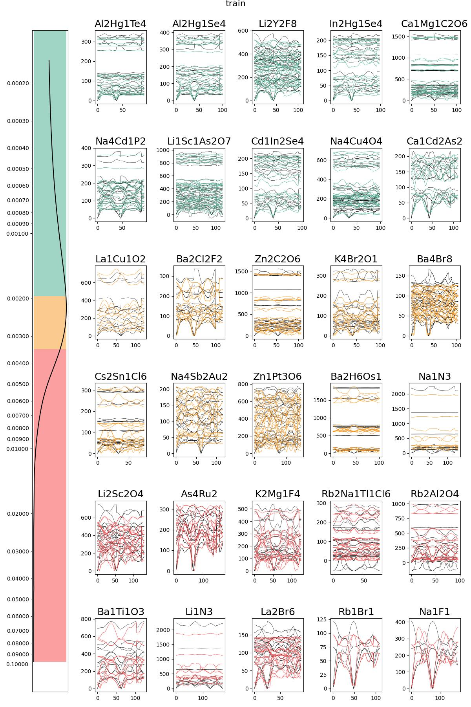
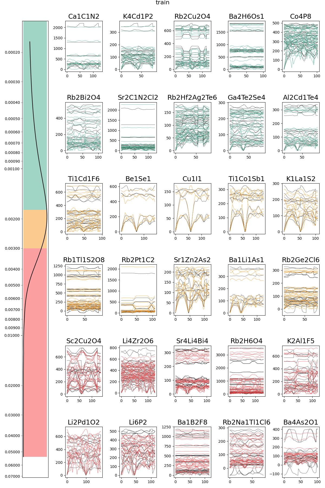
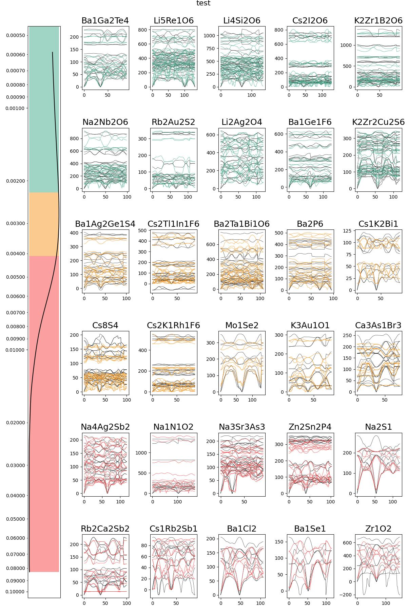
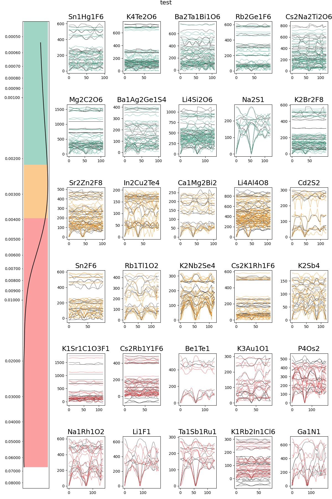

# VGNNA: Virtual Node Graph Neural Network with Attention for Full Phonon Prediction

This repository provides the implementation of the Virtual Node Graph Neural Network with Attention (VGNNA) for full phonon prediction in materials science. VGNNA is designed to address the challenges in phonon prediction using graph neural networks.

## Environment Setup

```bash
# Create virtual environment
conda create -n phonon python=3.9 -y
conda activate phonon

# Install dependencies
pip install uv
uv pip install -r requirements.txt -f https://pytorch-geometric.com/whl/torch-2.0.0+cu118.html
uv pip uninstall numpy
uv pip install "numpy<2.0.0"
```

## Configuration

Edit `configs/train.yaml` to customize training parameters.

Edit `configs/sample.yaml` to customize sampling parameters.

## Training

The Training process takes about 11.5h on a single 4090 GPU for 200 Iterations.

### Basic Usage

```bash
cd VGNNA/src
python train.py
```

### Override Parameters via Command Line

Any parameter in the YAML config can be overridden:

```bash
python train.py --lr 0.01 --max_iter 100
```

## Sampling

### Basic Usage

```bash
cd VGNNA/src
python sample.py
```

### Override Parameters via Command Line

Any parameter in the YAML config can be overridden:

```bash
python sample.py --out_dir ../viz --save_extension png
```

## Experimental Results

We evaluated the performance of k-MVN with and without attention mechanism on the phonon prediction task. The results demonstrate significant improvement when integrating Graph Transformer attention into the k-MVN architecture.

### Model Comparison

| Model | Dataset | Average Loss | Model Size (parameters) |
|--------|----------|---------------|-------------------------|
| k-MVN (baseline) | Train | 0.0039 | 123,208 |
| k-MVN (baseline) | Test | 0.0047 | 123,208 |
| **k-MVN + Attention** | Train | **0.0031** | **139,120** |
| **k-MVN + Attention** | Test | **0.0040** | **139,120** |

### Performance Analysis

**Training Set Improvement:**
- Loss reduction: 0.0039 → 0.0031 (20.5% improvement)

**Test Set Improvement:**
- Loss reduction: 0.0047 → 0.0040 (14.9% improvement)

**Model Complexity:**
- Parameter increase: 123,208 → 139,120 (12.9% increase)
- Performance improvement (14.9%) exceeds parameter increase (12.9%), indicating efficient use of additional capacity

### Visualization

The following figures compare the phonon band predictions between the baseline k-MVN model and the attention-enhanced model:

#### Training Set Predictions

**Baseline k-MVN Model:**
<p align="center">
  
</p>

**k-MVN with Attention:**
<p align="center">
  
</p>

#### Test Set Predictions

**Baseline k-MVN Model:**
<p align="center">
  
</p>

**k-MVN with Attention:**
<p align="center">
  
</p>

### Key Findings

1. **Significant Performance Gain**: The attention mechanism consistently improves prediction accuracy on both training and test sets.

2. **Improved Generalization**: The test set improvement (14.9%) is close to the training set improvement (20.5%), indicating good generalization without severe overfitting.

3. **Efficient Parameter Usage**: The 12.9% increase in model parameters yields a 14.9% improvement in test performance, demonstrating that the attention mechanism adds valuable modeling capability.

4. **Better Long-Range Modeling**: The graph-structured attention allows nodes to capture non-local dependencies, which is particularly important for phonon properties influenced by long-range interactions.

5. **Maintained Equivariance**: The attention mechanism operates only on scalar features (l=0 irreps), preserving the E(3) equivariance property of the original k-MVN architecture.

## Reference

- Virtual Node Graph Neural Network for Full Phonon Prediction [Paper](https://arxiv.org/abs/2301.02197) | [Github Code](https://github.com/RyotaroOKabe/phonon_prediction)
- Graph Transformer Networks for Accurate Band Structure Prediction: An End-to-End Approach [Paper](https://arxiv.org/abs/2411.16483) | [Github Code](https://github.com/qmatyanlab/Bandformer)
- **Dataset**: Petretto, Guido; Dwaraknath, Shyam; Miranda, Henrique P. C.; Winston, Donald; Giantomassi, Matteo; Rignanese, Gian-Marco; et al. (2018). High-throughput Density-Functional Perturbation Theory phonons for inorganic materials. figshare. Collection. [Dataset](https://doi.org/10.6084/m9.figshare.5649298)
- **Architecture:** Zhantao Chen, Nina Andrejevic, _et al._ "Virtual Node Graph Neural Network for Full Phonon Prediction." Adv. Sci. 8, 2004214 (2021). [Website](https://onlinelibrary.wiley.com/doi/10.1002/advs.202004214)
- **E(3)NN:** Mario Geiger, Tess Smidt, Alby M., Benjamin Kurt Miller, _et al._ Euclidean neural networks: e3nn (2020) v0.4.2. [Website](https://doi.org/10.5281/zenodo.5292912)
- **seekpath:** Y. Hinuma, G. Pizzi, Y. Kumagai, F. Oba, I. Tanaka, Band structure diagram paths based on crystallography, Comp. Mat. Sci. 128, 140 (2017) [Website](https://seekpath.readthedocs.io/en/latest/index.html)
- **Transformer Implementation**: We referred to [PyTorch's official implementation](https://pytorch.org/docs/stable/generated/torch.nn.Transformer.html) and [The Annotated Transformer](https://nlp.seas.harvard.edu/2018/04/03/attention.html).
- **Open Source Repositories**:
  - [Xtal2DoS](https://github.com/JunwenBai/Xtal2DoS)
  - [e3nn](https://github.com/e3nn/e3nn)
  - [nanoGPT](https://github.com/karpathy/nanoGPT)

## License

MIT License - See LICENSE file for details
